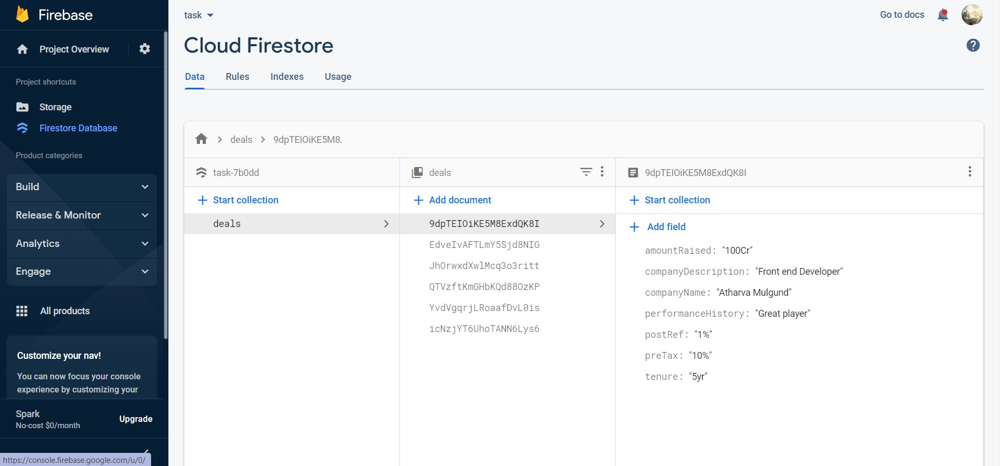
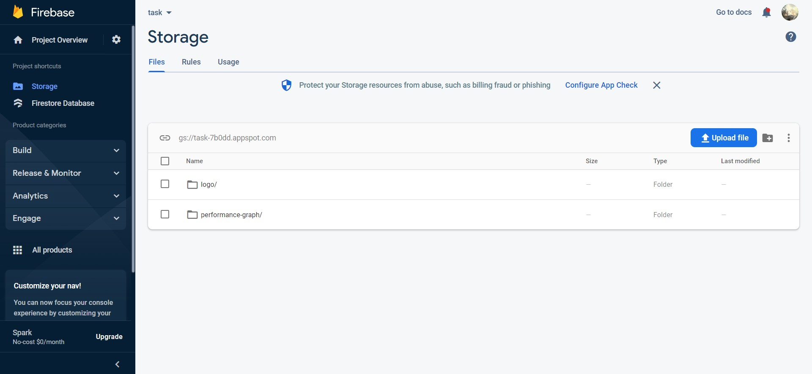
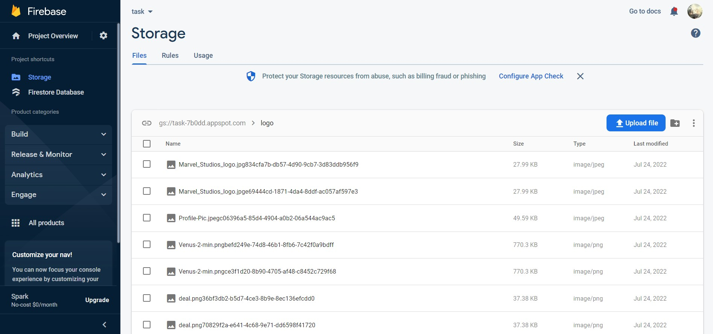
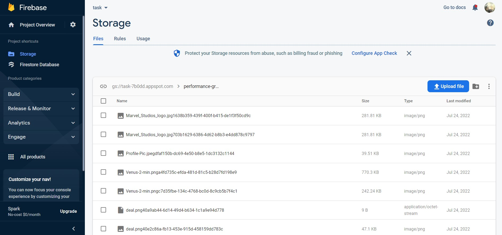

# Grow Lease Task

Task1: Create deal list page with nav bar and everything as designed. Fetch & Show all created deals in deals collection in firestore

Task2: Create a new deal screen and store the data as a document in deals collection. Store the image either in Firebase Storage or base 64 if you want.

## Demo

https://task-7b0dd.web.app/

## Features

- Quick Rendering and used hooks and refs
- Data fetching and storing from FireStore
- Data Storing of images in Firbase Storage
- MultiPage Site in Single Website

## Firebase ScreenShots

